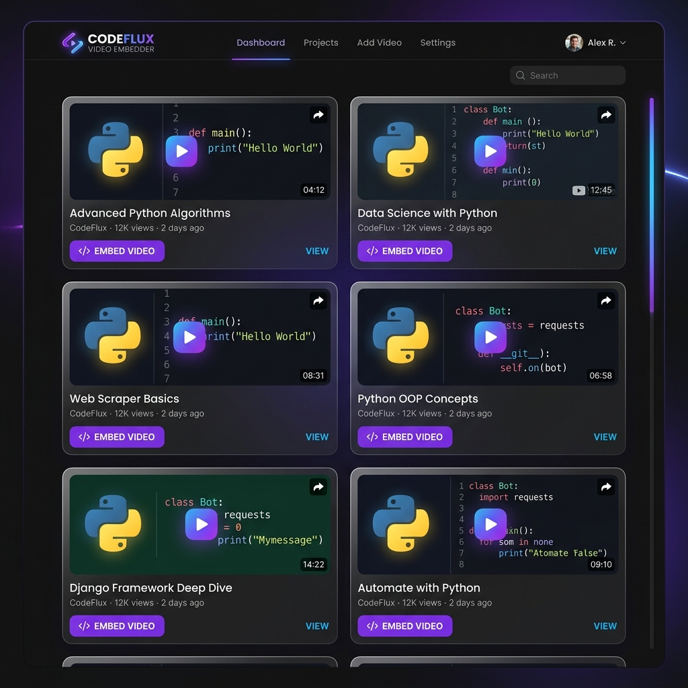

# StreamLine | Premium YouTube Embed

A professional, high-performance web application designed to showcase YouTube playlists with a stunning, modern aesthetic. Built with **Vanilla HTML, CSS, and JavaScript**, featuring a deep dark **Glassmorphic** design system.



## 🌟 Features

- **Premium UI**: Deep charcoal background with vibrant HSL accents and neon glow effects.
- **Glassmorphism**: Elegant use of `backdrop-filter` for translucent cards and navigation.
- **Dynamic Playlists**: Automatically fetches the latest videos from any YouTube playlist using the Data API v3.
- **Smooth Animations**: Responsive hover effects, staggered grid entry animations, and skeletal loaders.
- **Modern Typography**: Precision-crafted using Google Fonts (*Outfit* for headings, *Inter* for body).
- **Responsive Design**: Fully optimized for mobile, tablet, and desktop viewing.

## 🚀 Getting Started

To get this project running locally, follow these simple steps:

### 1. Prerequisites
- A modern web browser.
- A **YouTube Data API v3 Key**. You can obtain one via the [Google Cloud Console](https://console.cloud.google.com/).

### 2. Configuration
Open `js/script.js` and update the following variables:
```javascript
const apiKey = "your_API_key"; // Replace with your API key
const playlistId = "your_playlist_id"; // Replace with your Python playlist ID
```

### 3. Usage
- Simply open `index.html` in your browser.
- If you don't have an API key yet, the application will display a friendly setup guide.

## 🎨 Design Philosophy

StreamLine is built with a "Visual First" approach. The interface uses a carefully selected color palette (Deep Navy #0c0d12 and Azure #3f72af) combined with glassmorphism to create a sense of depth and hierarchy. The skeletal loaders ensure a perceived performance boost while data is being fetched.

## 📄 License

This project is licensed under the MIT License - see the [LICENSE](LICENSE) file for details.

---
Created with ❤️ by **Rajjit Laishram**, 2026.
